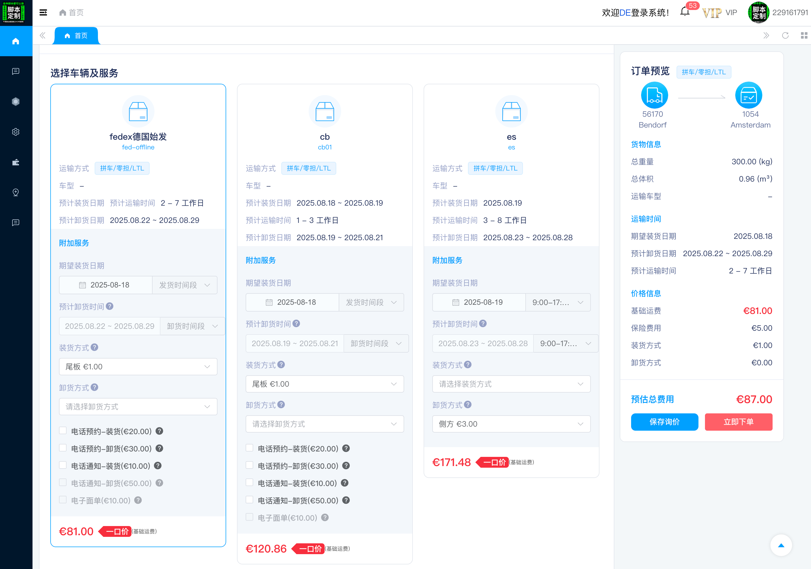

# 欧拉拉欧美卡派系统

#### 介绍
欧拉拉卡派系统是一个欧美尾程运输的AI智能数字化卡车平台，利用大数据、云计算、人工智能等技术，实现线上线下互联，为众多跨境企业提供“一站式”物流解决方案。以全流程闭环的线上交易平台和海量欧美卡车运力为基础，致力于高效满足各类用户不同类型的欧美货运需求。

案例：http://120.24.224.16:9001

#### 软件架构
- **前端**：使用 Vue3 + TypeScript + Element Plus 构建现代化的用户界面。
- **后端**：采用 JDK 21 + SpringBoot 3，提供强大的服务端支持，保证系统的高性能和稳定性。

#### 使用说明
- 登录系统后，用户可使用卡派物流的相关功能，包括但不限于货物追踪、订单管理、路线规划等。
- 具体功能详情请参考系统内的操作文档或联系商务支持。

#### 部分截图

#### 联系方式
商务合作或技术支持请联系 QQ：229161791
